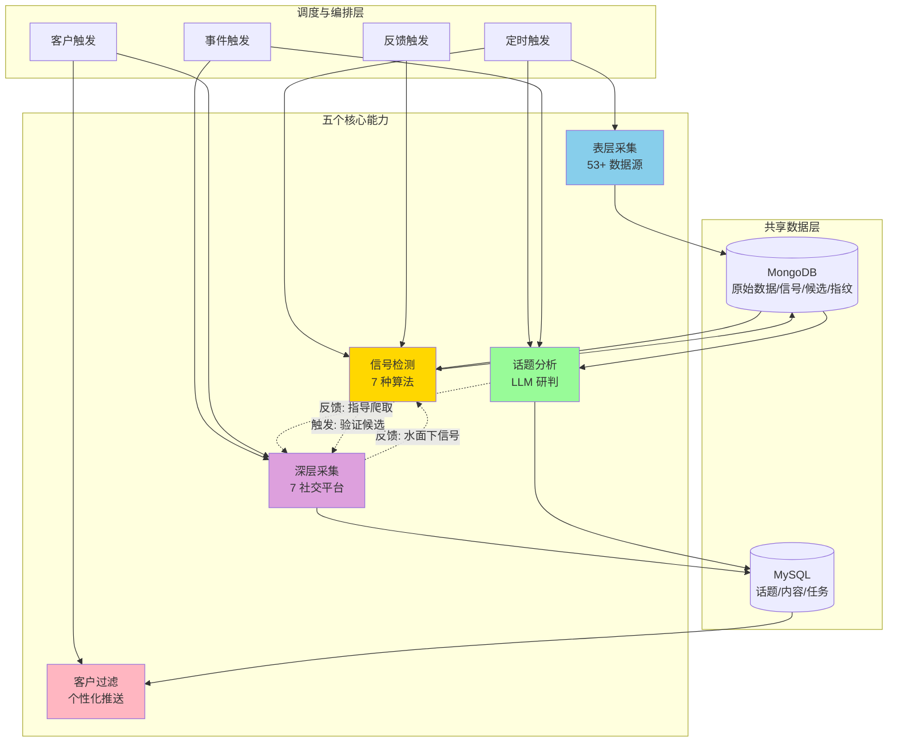

# MindSpider

<div align="center">


**AI 驱动的中文社交媒体舆情爬虫**

[功能特性](#功能特性) · [快速开始](#快速开始) · [使用指南](#使用指南) · [常见问题](#常见问题)

</div>

---

> **免责声明**：本项目仅供学习和研究目的使用，禁止用于商业用途。使用时请遵守相关法律法规和目标平台的服务条款。

## 项目概述

MindSpider 是一个基于 AI 的智能舆情监测系统，采用**能力化事件驱动架构**，通过五个核心能力（表层采集、深层采集、信号检测、话题分析、客户过滤）协同工作，实现从热点发现到深度内容采集的全自动化流程。

该部分学习借鉴github知名爬虫项目[MediaCrawler](https://github.com/NanmiCoder/MediaCrawler)

五个核心能力：

- **表层采集**：从 53+ 数据源（热榜、媒体、聚合器）采集表层数据，写入 MongoDB
- **深层采集**：在 7 大社交平台进行深度内容爬取（帖子、评论、讨论）
- **信号检测**：硬编码算法实时发现异动（热度飙升、跨平台共振、排名跃升等）
- **话题分析**：LLM 深度分析、语义聚类、趋势研判
- **客户过滤**：个性化相关性评分，支持品牌/地方/行业等不同客户类型

这些能力通过事件驱动编排，而非固定的线性流水线。

<div align="center">


MindSpider 运行示例
</div>

### 技术架构

- **编程语言**: Python 3.9+
- **AI框架**: 默认Deepseek，可以接入多种api (话题提取与分析)
- **爬虫框架**: Playwright (浏览器自动化)
- **数据库**: MySQL (数据持久化存储)
- **并发处理**: AsyncIO (异步并发爬取)

## 项目结构

```
MindSpider/
├── BroadTopicExtraction/           # 表层采集 + 信号检测 + 话题分析
│   ├── aggregators/               # 8 个聚合器（tophub, newsnow, official 等）
│   ├── spiders/                   # 15 个 Scrapy 爬虫
│   ├── pipeline/                  # 数据管道：配置加载、MongoDB 写入、去重
│   ├── scheduler/                 # APScheduler 定时调度
│   ├── analyzer/                  # 信号检测 + LLM 话题分析（开发中）
│   ├── config/                    # 数据源配置（YAML）
│   ├── start_scheduler.py         # 调度器启动入口
│   ├── database_manager.py        # MySQL 数据库管理器
│   └── main.py                    # 模块主入口
│
├── DeepSentimentCrawling/         # 深层采集
│   ├── keyword_manager.py         # 关键词管理器
│   ├── main.py                   # 模块主入口
│   ├── platform_crawler.py       # 平台爬虫管理器
│   └── MediaCrawler/             # 7 平台爬虫引擎
│   └── MediaCrawler/             # 多平台爬虫核心
│       ├── base/                 # 基础类
│       ├── cache/                # 缓存系统
│       ├── config/               # 配置文件
│       ├── media_platform/       # 各平台实现
│       │   ├── bilibili/        # B站爬虫
│       │   ├── douyin/          # 抖音爬虫
│       │   ├── kuaishou/        # 快手爬虫
│       │   ├── tieba/           # 贴吧爬虫
│       │   ├── weibo/           # 微博爬虫
│       │   ├── xhs/             # 小红书爬虫
│       │   └── zhihu/           # 知乎爬虫
│       ├── model/               # 数据模型
│       ├── proxy/               # 代理管理
│       ├── store/               # 存储层
│       └── tools/               # 工具集
│
├── schema/                       # 数据库架构
│   ├── db_manager.py            # 数据库管理
│   ├── init_database.py         # 初始化脚本
│   └── mindspider_tables.sql    # 表结构定义
│
├── config.py                    # 全局配置文件
├── main.py                      # 系统主入口
├── requirements.txt             # 依赖列表
└── README.md                    # 项目文档
```

## 系统工作流程

### 整体架构流程图



### 工作流程说明

#### 1. 表层采集（Surface Collection）

从 53+ 数据源持续采集表层数据，写入 MongoDB：

1. **全国热搜**：微博、百度、头条、抖音、B站等 10+ 平台热榜
2. **垂直行业**：科技（掘金、36氪、IT之家）、财经（财联社、雪球）
3. **传统媒体**：新华社、央视、人民日报等权威媒体
4. **聚合平台**：今日热榜、NewsNow 等交叉验证

#### 2. 信号检测（Signal Detection）

硬编码算法每 30 分钟运行，发现异动信号：

1. **内部检测**：热度飙升（velocity）、新上榜高位（new_entry）、排名跃升（position_jump）
2. **交叉检测**：跨平台共振（cross_platform）、权威背书（authority_boost）、垂直破圈（vertical_break）
3. **早期预警库**：候选话题状态机（emerging → rising → confirmed）

#### 3. 话题分析（Topic Analysis）

LLM 每天 2 次深度分析（晨报 + 晚报）：

1. **语义聚类**：合并不同平台对同一事件的不同表述
2. **重要性评分**：综合热度、跨平台数、权威背书等多维度评分
3. **趋势研判**：结合传播指纹库预测后续走势

#### 4. 深层采集（Deep Collection）

在 7 大社交平台进行深度内容爬取，由多种触发源驱动：

1. **事件触发**：热点确认后全平台爬取、早期预警验证
2. **客户触发**：品牌关键词监测、区域内容监测
3. **反馈机制**：深层数据反馈给信号检测，发现热榜上看不到的信号

## 数据库架构

### 核心数据表

1. **daily_news** - 每日新闻表
   - 存储从各平台采集的热点新闻
   - 包含标题、链接、描述、排名等信息

2. **daily_topics** - 每日话题表
   - 存储AI提取的话题和关键词
   - 包含话题名称、描述、关键词列表等

3. **topic_news_relation** - 话题新闻关联表
   - 记录话题与新闻的关联关系
   - 包含关联度得分

4. **crawling_tasks** - 爬取任务表
   - 管理各平台的爬取任务
   - 记录任务状态、进度、结果等

5. **平台内容表**（继承自MediaCrawler）
   - xhs_note - 小红书笔记（暂时废弃，详情查看：https://github.com/NanmiCoder/MediaCrawler/issues/754）
   - douyin_aweme - 抖音视频
   - kuaishou_video - 快手视频
   - bilibili_video - B站视频
   - weibo_note - 微博帖子
   - tieba_note - 贴吧帖子
   - zhihu_content - 知乎内容

## 安装部署

### 环境要求

- Python 3.9 或更高版本
- MySQL 5.7 或更高版本，或 PostgreSQL
- Conda环境：pytorch_python11（推荐）
- 操作系统：Windows/Linux/macOS


### 1. 克隆项目

```bash
git clone https://github.com/twreport/mind-spider.git
cd mind-spider
```

### 2. 创建并激活环境

#### Conda配置方法

#### Conda配置方法

```bash
# 创建名为 pytorch_python11 的conda环境并指定Python版本
conda create -n pytorch_python11 python=3.11
# 激活该环境
conda activate pytorch_python11
```

#### UV配置方法

> [UV 是一种快速轻量级 Python 包环境管理工具，适用于低依赖及便捷管理需求。可参考：https://github.com/astral-sh/uv]

- 安装uv（如未安装）
```bash
pip install uv
```
- 创建虚拟环境并激活
```bash
uv venv --python 3.11 # 创建3.11环境
source .venv/bin/activate   # Linux/macOS
# 或
.venv\Scripts\activate      # Windows
```


### 3. 安装依赖

```bash
# 安装Python依赖
pip install -r requirements.txt

或
# uv版本更加快速
uv pip install -r requirements.txt


# 安装Playwright浏览器驱动
playwright install
```

### 4. 配置系统

复制.env.example文件为.env文件，放置在项目根目录。编辑 `.env` 文件，设置数据库和API配置：

```python
# MySQL数据库配置
DB_HOST = "your_database_host"
DB_PORT = 3306
DB_USER = "your_username"
DB_PASSWORD = "your_password"
DB_NAME = "mindspider"
DB_CHARSET = "utf8mb4"

# MINDSPIDER API密钥
MINDSPIDER_BASE_URL=your_api_base_url
MINDSPIDER_API_KEY=sk-your-key
MINDSPIDER_MODEL_NAME=deepseek-chat
```

### 5. 初始化系统

```bash
# 检查系统状态
python main.py --status
```

## 使用指南

### 完整流程

```bash
# 1. 运行话题提取（获取热点新闻和关键词）
python main.py --broad-topic

# 2. 运行爬虫（基于关键词爬取各平台内容）
python main.py --deep-sentiment --test

# 或者一次性运行完整流程
python main.py --complete --test
```

### 单独使用模块

```bash
# 只获取今日热点和关键词
python main.py --broad-topic

# 只爬取特定平台
python main.py --deep-sentiment --platforms xhs dy --test

# 指定日期
python main.py --broad-topic --date 2024-01-15
```

## 爬虫配置（重要）

### 平台登录配置

**首次使用每个平台都需要登录，这是最关键的步骤：**

1. **小红书登录**（暂时废弃，详情查看：https://github.com/NanmiCoder/MediaCrawler/issues/754）
```bash
# 测试小红书爬取（会弹出二维码）
python main.py --deep-sentiment --platforms xhs --test
# 用小红书APP扫码登录，登录成功后会自动保存状态
```

2. **抖音登录**
```bash
# 测试抖音爬取
python main.py --deep-sentiment --platforms dy --test
# 用抖音APP扫码登录
```

3. **其他平台同理**
```bash
# 快手
python main.py --deep-sentiment --platforms ks --test

# B站
python main.py --deep-sentiment --platforms bili --test

# 微博
python main.py --deep-sentiment --platforms wb --test

# 贴吧
python main.py --deep-sentiment --platforms tieba --test

# 知乎
python main.py --deep-sentiment --platforms zhihu --test
```

### 登录问题排除

**如果登录失败或卡住：**

1. **检查网络**：确保能正常访问对应平台
2. **关闭无头模式**：编辑 `DeepSentimentCrawling/MediaCrawler/config/base_config.py`
   ```python
   HEADLESS = False  # 改为False，可以看到浏览器界面
   ```
3. **手动处理验证**：有些平台可能需要手动滑动验证码
4. **重新登录**：删除 `DeepSentimentCrawling/MediaCrawler/browser_data/` 目录重新登录

### 其他问题

如有其他问题，请在 [GitHub Issues](https://github.com/twreport/mind-spider/issues) 中提交。

### 爬取参数调整

在实际使用前建议调整爬取参数：

```bash
# 小规模测试（推荐先这样测试）
python main.py --complete --test

# 调整爬取数量
python main.py --complete --max-keywords 20 --max-notes 30
```

### 高级功能

#### 1. 指定日期操作
```bash
# 提取指定日期的话题
python main.py --broad-topic --date 2024-01-15

# 爬取指定日期的内容
python main.py --deep-sentiment --date 2024-01-15
```

#### 2. 指定平台爬取
```bash
# 只爬取B站和抖音
python main.py --deep-sentiment --platforms bili dy --test

# 爬取所有平台的特定数量内容
python main.py --deep-sentiment --max-keywords 30 --max-notes 20
```

## 常用参数

```bash
--status              # 检查项目状态
--setup               # 初始化项目(废弃，已自动初始化)
--broad-topic         # 话题提取
--deep-sentiment      # 爬虫模块
--complete            # 完整流程
--test                # 测试模式（少量数据）
--platforms xhs dy    # 指定平台
--date 2024-01-15     # 指定日期
```

## 支持的平台

| 代码 | 平台 | 代码 | 平台 |
|-----|-----|-----|-----|
| xhs | 小红书 | wb | 微博 |
| dy | 抖音 | tieba | 贴吧 |
| ks | 快手 | zhihu | 知乎 |
| bili | B站 | | |

## 常见问题

### 1. 爬虫登录失败
```bash
# 问题：二维码不显示或登录失败
# 解决：关闭无头模式，手动登录
# 编辑：DeepSentimentCrawling/MediaCrawler/config/base_config.py
HEADLESS = False

# 重新运行登录
python main.py --deep-sentiment --platforms xhs --test
```

### 2. 数据库连接失败
```bash
# 检查配置
python main.py --status

# 检查config.py中的数据库配置是否正确
```

### 3. playwright安装失败
```bash
# 重新安装
pip install playwright

或

uv pip install playwright

playwright install
```

### 4. 爬取数据为空
- 确保平台已经登录成功
- 检查关键词是否存在（先运行话题提取）
- 使用测试模式验证：`--test`

### 5. API调用失败
- 检查DeepSeek API密钥是否正确
- 确认API额度是否充足

## 注意事项

1. **首次使用必须先登录各平台**
2. **建议先用测试模式验证**
3. **遵守平台使用规则**
4. **仅供学习研究使用**

## 项目开发指南

### 扩展新的新闻源

在 `BroadTopicExtraction/get_today_news.py` 中添加新的新闻源：

```python
async def get_new_platform_news(self) -> List[Dict]:
    """获取新平台的热点新闻"""
    # 实现新闻采集逻辑
    pass
```

### 扩展新的爬虫平台

1. 在 `DeepSentimentCrawling/MediaCrawler/media_platform/` 下创建新平台目录
2. 实现平台的核心功能模块：
   - `client.py`: API客户端
   - `core.py`: 爬虫核心逻辑
   - `login.py`: 登录逻辑
   - `field.py`: 数据字段定义

### 数据库扩展

如需添加新的数据表或字段，请更新 `schema/mindspider_tables.sql` 并运行：

```bash
python schema/init_database.py
```

## 性能优化建议

1. **数据库优化**
   - 定期清理历史数据
   - 为高频查询字段建立索引
   - 考虑使用分区表管理大量数据

2. **爬取优化**
   - 合理设置爬取间隔避免被限制
   - 使用代理池提高稳定性
   - 控制并发数避免资源耗尽

3. **系统优化**
   - 使用Redis缓存热点数据
   - 异步任务队列处理耗时操作
   - 定期监控系统资源使用

## API接口说明

系统提供Python API供二次开发：

```python
from BroadTopicExtraction import BroadTopicExtraction
from DeepSentimentCrawling import DeepSentimentCrawling

# 话题提取
async def extract_topics():
    extractor = BroadTopicExtraction()
    result = await extractor.run_daily_extraction()
    return result

# 内容爬取
def crawl_content():
    crawler = DeepSentimentCrawling()
    result = crawler.run_daily_crawling(
        platforms=['xhs', 'dy'],
        max_keywords=50,
        max_notes=30
    )
    return result
```

## 许可证

本项目仅供学习研究使用，请勿用于商业用途。使用本项目时请遵守相关法律法规和平台服务条款。

## 致谢

本项目的爬虫模块基于 [MediaCrawler](https://github.com/NanmiCoder/MediaCrawler) 开发，感谢原作者的贡献。

---

<div align="center">

**[报告问题](https://github.com/twreport/mind-spider/issues)** · **[功能请求](https://github.com/twreport/mind-spider/issues)** · **[贡献代码](https://github.com/twreport/mind-spider/pulls)**

Made with ❤️ by [twreport](https://github.com/twreport)

</div>
